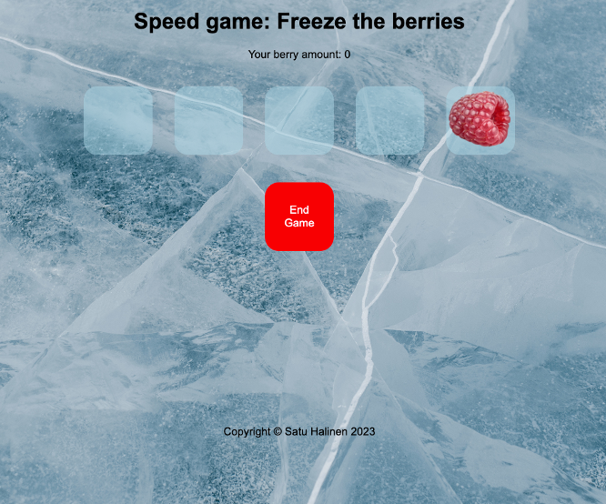

# Speed game

## Introduction

Speed game is a project done on a course called Programming JavaScript at Business College Helsinki in August - October 2023. The theme is freezing berries. By touching a visible berry with snow flake you freeze the berry. If you don't touch the right berry, your game ends.

## Languages used

JavaScript, HTML, CSS

## Visuals

## Other information

Later, in October - December 2023 in a course called React basics a React version of this app was done. Check it out from here: [Speed game React](https://github.com/satuhalinen/React/tree/main/speed_game_react)
